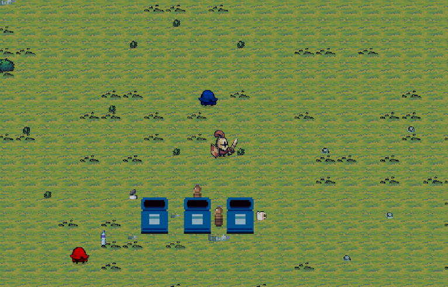
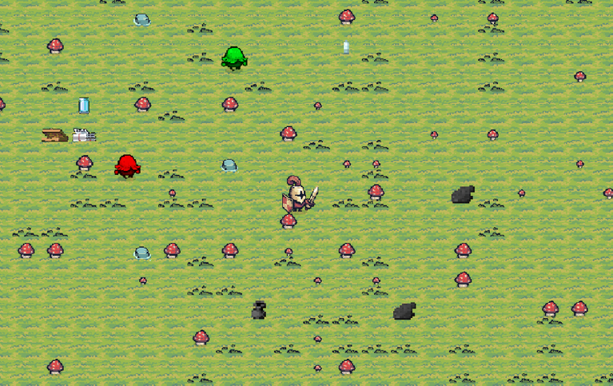

# 👾 Recycling Battle

Esse é um protótipo de jogo 2D que foi criado para um projeto educacional sobre reciclagem. Inspirado no Vampire Survivors,
 o jogo segue uma mecânica roguelike com uma visão top-down e gráficos pixel art. A ideia é envolver os jogadores no mundo da reciclagem,
 enfrentando desafios enquanto aprendem a importância de preservar o planeta.


## 🎨Preview


## 🕹️Controles
```
Movimento: WASD e Setas do teclado


Batalha: Botão esquerdo do mouse ou Tecla Z.
```

## 🗃️Assets 

📌[Tiny Swords: Pixel Frog](https://pixelfrog-assets.itch.io/tiny-swords)
<br/>
<br/>
📌[Recycle items art: Clint Bellanger](https://opengameart.org/content/recycle-items-set)
<br/>
<br/>
📌[Grass/Dead Grass Platformer Tileset: PROWNE](https://opengameart.org/content/grassdead-grass-platformer-tileset)
<br/>
<br/>
📌[Pixel Food: Henry Software](https://henrysoftware.itch.io/pixel-food)
<br/>
<br/>
📌[Trash Pack: BTL games](https://btl-games.itch.io/trash-and-junk-asset-pack)
<br/>
<br/>


